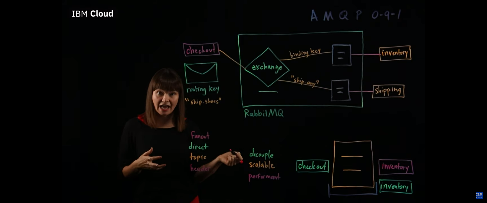

نقشه راه:
(در حال طراحی)
1. باینری چیست و چطور همه چیز در کامپیوتر باینری است
2. اختصاص فضا در رم چطور کار می کند
3. تفاوت اختصاص رم در پایتون با برنامه های استاتیک تایپ 
4. انواع پردازش موازی
5. انواع پردازش موازی در پایتون
6. مسیج بروکر
6. سلری

حتما تا به حال شده که یک عملیات سنگین و زمانبر اجرا اپلیکیشن شما رو متوقف کرده و مجبور بودید منتظر بمانید تا عملیات تمام شود و ادامه کد اجرا شود. البته اگر در زبان های ایسینک مثل جاوا اسکریپت یا تایپ اسکریپت کد زده باشید به این مشکل بر نمیخورید به این دلیل که آن ها به ذات ایسینک هستند. با این حال پایتون یک زبان سینکرنوس هست که باید صبر کند تا هر عملیات تمام شود تا سراغ بعدی برود. حالا اگر بخواییم به پایتون بگیم این خط رو انجام بده ولی منتظر جوابش نمون و برو خط بعدی باید از مولتی ها استفاده کنیم. حالا مولتی پراسس یا مولتی ترد؟ سوال جالبیه بریم که جوابش رو بدیم.

ابتدا برای پاسخگویی به این سوال باید انواع پرداز موازی رو با هم بررسی کنیم. به طور کلی پردازش موازی (در ذات این کلمه مشکل داره) به دو حالت
1. concurrent
2. parallel
تقسیم میشوند. در حالت اول، سی پی یو کامپیوتر زمان رو به تعداد پردازش ها تقسیم می کنه و برای هر پردازش یک مقدار کوچکی زمان اختصاص میده و بین تسک ها جا به جا میشه. در این حالت به نظر میرسه که پردازش ها به طور همزمان دارن انجام میشن ولی در واقع اینجوری نیست بلکه زمان سی پیو به طور مساوی بین تسک ها تقسیم میشه و یک احساس موازی بودن میده. اما پردازش پارالل یا موازی به طور واقعی اگر سی پیو کامیپوتر به طور فیزیکی تعداد مورد نیاز هسته مجزا داشته باشه، هر پردازش در یک هسته مجزا اجرا شده و به طور همزمان جلو میروند.

در پایتون یک مفهوم به نام قفل وجود داره که باعث میشه در آن واحد، هر ایسنتنس از پایتون دو پردازش موازی رو انجام نده، برای همین اگر ما قصد داشته باشیم که دو عملیات رو به طور همزمان انجام بدیم باید اینستنت متفاوت از پایتون بسازیم. اما ما همیشه هم نیاز نداریم که پردازش واقعا موازی انجام بدیم. برای درک بهتر این موضوع لازمه ابتدا انواع عملیتن زمان بر رو بشناسیم.

# انواع عملیات زمانبر
1. عملیات مبتنی بر پردازشگر
2. عملیات مبتنی بر دیسک
3. عملیات مبتنی بر شبکه

عملیات مبتنی بر دیسک از مواردی هستند که توسط سیستم عامل انجام میشن و به محض سپردنش به سیستم عامل دیگه به پایتون ارتباطی ندارن. از همین رو اختصاص دادن یک بخشی از زمان سی پیو برای سپردن کار و گرفتن نتیجه کار در واقع ورک فلو برنامه رو از عملیات زمانبر مبتنی بر دیسک جدا می کند. در مورد عملیات مبتنی بر شبکه نیز تمام این موارد صادق است، تنها چیزی که ما نیاز داریم فرستادن یک درخواست به شبکه و انتظار برای پاسخ است. در حالت عادی برنامه ما منتظر دریافت شبکه می ماند اما با کانکارنسی ما بهش دستور میدیم که تایم سی پیو رو تقسیم کنه و فعالیت های دیگه رو انجام بده و هر از گاهی نتیجه درخواست ما رو هم چک کنه.

با این حال برای عملیات مبتنی بر پردازشگر اگر از کانکارنسی استفاده بشه هیچ بهبودی در سرعت عملیات دیده نمیشه. در این مثال نیاز هست تا از هسته ای دیگه استفاده بشه.

در پایتون برای استفاده از کانکارنسی از threading و برای استفاده از پارالل از multiprocessing استفاده میشه.


```python
import threading
import multiprocessing
import time

def do_something():
    print('sleeping 1 second...')
    time.sleep(1)
    print('done sleeping...')

if __name__ == '__main__':
    start = time.perf_counter()

    t1 = threading.Thread(target=do_something)
    t2 = threading.Thread(target=do_something)

    t1.start()
    t2.start()

    t1.join()
    t2.join()

    finish = time.perf_counter()

    print(f'Finished in {round(finish-start, 2)} second(s)')

    start = time.perf_counter()
    proc1 = multiprocessing.Process(target=do_something)
    proc2 = multiprocessing.Process(target=do_something)
    proc1.start()
    proc2.start()
    proc1.join()
    proc2.join()
    finish = time.perf_counter()
    print(f'Finished in {round(finish-start, 2)} second(s)')
```

مثال بالا به طور کامل نحوه استفاده از این دو مفهوم در پایتون رو نشون میده، ولی مساله پیچیده تر از این حرف هاست. فرض کنید شما یک هزار عملیات زمانبر مبتنی بر پردازش دارید، میخوایید این پردازش هارو در کمترین زمان ممکن انجام بدید. برای انجام این کار ساده باید کار های پیچیده ای مثل واگذاری عملیات به هسته ها و همچنین هندل کردن خطا و خیلی چیز های دیگه رو انجام بدید. گرچه در صورت نیاز میتونید از همین دستورات ساده پایتونی استفاده کنید، اما یک کتابخونه عالی برای دور کردن این سردرد ها از شما به وجود اومده که استفاده از مولتی ها رو براتون آسون می کنه. اما قبل از معرفی اون لازمه که با مفهوم مسیج بروکر آشنا بشیم.


# message broker

مسیج بروکر ها رابط های میانی ای هستن که کار انتقال پیام بین دو موجودیت (بخوانید اپلیکیشن) رو راحت تر می کنن. فرض کنید دو اپلیکیشن دارید که میخوان با هم صحبت کنن. در این میان چند مشکل وجود داره که ممکن اجرا رو با خطر مواجه کنه.

1. روشن نبود، فعال نبودن و یا مشغول بودن اپلیکیشن گیرنده
2. شبکه اتصال دهنده اپلیکیشن ها با کندی مواجه بشه
3. زبان مقصد پروتوکل زبان مبدا رو نشناسه

در حالت اول و دوم میگیم دو اپلیکیشن به هم دیگه کاپل شده یا وابسطه هستند، یعنی اگر برنامه دوم جواب نده برنامه اول قفل می کنه و منتظر میشه.

در حالت سوم هم میگیم برنامه ما قابل توسعه نیست و محدودیت در زبان مقصد رو داریم.

برای رفع این مشکل پدیده ای به نام مسیج بروکر اومده که این مشکلات رو برای ما به شکل معجزه آسایی حل کنه.

اپلیکیشن اول پیام رو تحویل مسیج بروکر میده و میره پی کار خودش، از اینجا به بعدش رو میسپاره به مسیج بروکر، مسیج بروکر هم پیام هارو نگه میداره و دونه دونه با حوصله تحویل گیرنده میده، اگر گیرنده در دسترس نباشه پیام هارو نگه میداره تا در دسترس قرار بگیره، همینطور تبدیل پروتکل های ارتباطی رو هم برامون انجام میده. البته خیلی کار های دیگه هم می کنه که از حوصله بحث حاضر خارجه.



برای کسب اطلاعات کامل از مسیج بروکر ها این ویدیو رو پیشنهاد می کنم:
https://www.youtube.com/watch?v=7rkeORD4jSw&t=435s

# celery

سلری یک ابزار پایتونی مولتی سازه که از مسیج بروکر ها بهره میبره تا قابلیت های عالی ای رو برامون فراهم کنه.

برای استفاده از سلری نیاز هست از یک مسیج بروکر استفاده کنیم که ما در اینجا از ردیس استفاده می کنیم، چنان چه در مورد ردیس چیزی نمیدونید در اینجا میتونید در موردش بخونید:
https://github.com/sadeghesfahani/Redis

پس از نصب و راه اندازی ردیس حالا نوبت به نصب و راه اندازی سلری است برای این کار از دستور 

```
pip install celery
```

استفاده می کنیم. پس از نصب آن آماده استفاده از آن هستیم. ابتدا لازم است یک اینستنس از سلری بسازیم:

```python
# tasks.py
from celery import Celery

app = Celery('tasks', broker='redis://localhost:6379/0')

```
<p style="direction:rtl">
حالا که اینستنس ما آماده استفاده است، از یک متد دکوریتور آن به نام task استفاده می کنیم
</p>

```python
# tasks.py

from celery import Celery

app = Celery('tasks', broker='redis://localhost:6379/0')

@app.task
def out_function(args):
    pass

```

حالا که اولیت تسک ما ساخته شد، برای اجرا لازمه که کارگر برای انجام این کار بسازیم. برای ساخت کارگر به دایرکتوری فایل ایجاد شده رفته و دستور زیر را اجرا می کنیم.

```
python -m celery -A tasks worker --loglevel=INFO 
```

سلری از نسخه ۴ به بعد دیگر از ویندوز پشتیبانی نمیکند و برای استفاده آن در ویندوز باید استخری که تسک ها در آن به اشتراک گذاشته میشن رو به چیزی غیر از مولتی پراسس تغییر دهید که عموما به طور مولتی ترد کار می کنند.

```
python -m celery -A tasks worker --pool=solo --loglevel=INFO    # this uses single proccess
python -m celery -A tasks worker --pool=eventlet --loglevel=INFO  # this uses multithread
```

همچنین اگر نیاز به دیباگ داشتید میتونید با تغییر لاگ لول به دیباگ اطلاعات بیشتری از اجرا کارگرتون رو بگیرید

توجه داشته باشید که برای استفاده در ویندوز باید 

```
pip install eventlet
```
رو هم نصب داشته باشید.

حالا که کارگر ما حاضره، میتونیم از تسک هامون به صورت ایسینک استفاده کنیم. برای اینکار میتونیم از متدی به نام دیلی یا اپلای ایسینک استفاده کنیم، بریم چند مثال از اون رو ببینیم:

```python
# tasks.py

from celery import Celery
import time
app = Celery('tasks', broker='redis://localhost:6379/0')

@app.task
def print_this_after_a_second(message):
    time.sleep(1)
    print(message)


print_this_after_a_second.delay('hello world')
print_this_after_a_second.apply_async(('hello world',))
```

تفاوتی که در این دو وجود دارد، در اپلی ایسینک ما میتونیم خصوصیات بیشتری برای اجرا بهش رو بدیم به عنوان مثال به این موارد توجه کنید:

```python
# tasks.py

from celery import Celery
import time
app = Celery('tasks', broker='redis://localhost:6379/0')

@app.task
def print_this_after_a_second(message):
    time.sleep(1)
    print(message)


print_this_after_a_second.apply_async(('hello world',), countdown=10) # executes in 10 seconds from now.
print_this_after_a_second.apply_async(('hello world',), countdown = 10, expires=120) # executes in one minute from now, but expires after 2 minutes.
```

در این مثال بالا ما نیازی نداشتیم که خروجی خاصی از فانکشنمون دریافت کنیم، اما در مواردی نیاز هست که این کارو انجام بدیم. البته با انجام اینکار مجدد ورک فلو برنامه در اون لاین متوقف میشه ولی تمام عملیات تا قبل از اون خط به طور موازی انجام میشه پس میتونه بازی رو بسیار به نفع ما عوض کنه.

```python
# tasks.py

from celery import Celery
import time
app = Celery('tasks', broker='redis://localhost:6379/0')

@app.task
def multiply(var1,var2):
    time.sleep(10)
    return var1 * var2


result = multiply.apply_async((2,2))
result2 = multiply.delay(3,3)

print(result.get())
print(result2.get())
```
در مثال بالا برنامه ما ۱۰ ثانیه متوقف میشه تا جواب ریزالت رو بگیره اما چون دو نتیجه ۱ و ۲ با سلری اجرا شدن پس از ۱۰ ثانیه جفت جواب هارو خواهیم گرفت نه بعد از ۲۰ ثانیه.

همینطور در مواقعی نیاز هست که ما وضعیت عملیات هامون رو زیر نظر داشته باشیم برای این منظور هم میتونیم از دستورات زیر استفاده کنیم:

```python
res.failed() # returns True if the task failed.
res.successful() # returns True if the task succeeded.
res.state  # PENDING -> STARTED -> SUCCESS or FAILURE
# @task(track_started=True) is necessary to track the state of start.
```

اما توجه داشته باشید که هم برای گرفتن مقدار خروجی یک تابع و هم برای گرفتن وضعیت یک تسک نیاز هست تا این موارد در یک دیتابیس مجزا ذخیره بشه، از اونجایی که ما برای بروکر از ردیس استفاده کردیم، برای کاهش دیپندنسی برناممون هم از بک اند ردیس استفاده می کنیم. برای اینکار در هنگام ساختن نمونه از سلری به اینگونه عمل می کنیم:

```python
from celery import Celery
app = Celery('tasks', broker='redis://localhost:6379/0', backend='redis://localhost:6379')
```


 همچنین برای محدود سازی یک تسک به مقدار در دقیقه از دستور زیر استفاده می کنیم
```
python -m celery -A tasks control rate_limit tasks.multiply 10/m
```


# استفاده از سلری در جنگو

برای استفاده از سلری در جنگو لازم هست مانند همین مثال های قبلی در یک محل یک اینستنس از سلری بسازیم و آن را در جنگو قرار دهیم.

برای این منظور ابتدا یک فایل به اسم دلخواه اما ترجیها سلری در کنار فایل ستینگ جنگو بسازید. سپس مقادیر زیر را وارد آن کنید

```python
import os

from celery import Celery 
 
os.environ.setdefault("DJANGO_SETTINGS_MODULE", "django_celery.settings") # 1
app = Celery("django_celery") # 2
app.config_from_object("django.conf:settings", namespace="CELERY") # 3
app.autodiscover_tasks() # 4

```

1. با اینکار محلی که باید تنظیمات ستینگ از آن خوانده شود در متغییر محلی سیستم عامل ذخیره میشود، در این مثال اسم اپلیکیشن ما جنگو سلری است
2. اینجا یک اینستنس از سلری ساخته میشود که اسم اپلیکیشن ما را دریافت میکند
3. تنظیمات سلری ما از داخل فایل ستینگ جنگو بارگذاری میشود، بخش نیم اسپیس نشون میده که دنبال چه ثابت هایی بگرده که در این مثال میشه ثابت هایی که با سلری شروع میشن
4. این قسمت باعث میشه سلری بره و توی اپ جنگو ما بگرده و تمام تسک هارو اتوماتیک پیدا کنه

پس از ساختن نمونه از سلری لازمه که این نمونه رو در اپلیکیشن جنگوی خودمون قرار بریم، برای این منظور به فایل اینیت در محل قرارگیری تنظیمات جنگو برید و عبارت زیر را وارد کنید:

```python
# __init__.py

from .celery import app as celery_app

__all__ = ("celery_app",)
```

با انجام این تنظیمات حالا در هرجایی از برنامه میتونید تسک بسازید و از آن استفاده کنید. اما نحوه ساختن تسک در جنگو کمی متفاوت است برای ساختن تسک اینگونه عمل می کنیم:

```python
from celery import shared_task

@shared_task()
def some_task():
    pass

```
