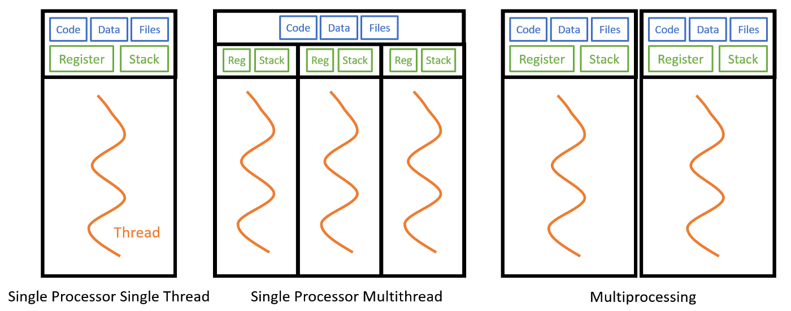

نقشه راه:
(در حال طراحی)
1. باینری چیست و چطور همه چیز در کامپیوتر باینری است
2. اختصاص فضا در رم چطور کار می کند
3. تفاوت اختصاص رم در پایتون با برنامه های استاتیک تایپ 
4. انواع پردازش موازی
5. انواع پردازش موازی در پایتون
6. مسیج بروکر
6. سلری

حتما تا به حال شده که یک عملیات سنگین و زمانبر اجرا اپلیکیشن شما رو متوقف کرده و مجبور بودید منتظر بمانید تا عملیات تمام شود و ادامه کد اجرا شود. البته اگر در زبان های ایسینک مثل جاوا اسکریپت یا تایپ اسکریپت کد زده باشید به این مشکل بر نمیخورید به این دلیل که آن ها به ذات ایسینک هستند. با این حال پایتون یک زبان سینکرنوس هست که باید صبر کند تا هر عملیات تمام شود تا سراغ بعدی برود. حالا اگر بخواییم به پایتون بگیم این خط رو انجام بده ولی منتظر جوابش نمون و برو خط بعدی باید از مولتی ها استفاده کنیم. حالا مولتی پراسس یا مولتی ترد؟ سوال جالبیه بریم که جوابش رو بدیم.

ابتدا برای پاسخگویی به این سوال باید انواع پرداز موازی رو با هم بررسی کنیم. به طور کلی پردازش موازی (در ذات این کلمه مشکل داره) به دو حالت
1. concurrent
2. parallel
تقسیم میشوند. در حالت اول، سی پی یو کامپیوتر زمان رو به تعداد پردازش ها تقسیم می کنه و برای هر پردازش یک مقدار کوچکی زمان اختصاص میده و بین تسک ها جا به جا میشه. در این حالت به نظر میرسه که پردازش ها به طور همزمان دارن انجام میشن ولی در واقع اینجوری نیست بلکه زمان سی پیو به طور مساوی بین تسک ها تقسیم میشه و یک احساس موازی بودن میده. اما پردازش پارالل یا موازی به طور واقعی اگر سی پیو کامیپوتر به طور فیزیکی تعداد مورد نیاز هسته مجزا داشته باشه، هر پردازش در یک هسته مجزا اجرا شده و به طور همزمان جلو میروند.

در پایتون یک مفهوم به نام قفل وجود داره که باعث میشه در آن واحد، هر ایسنتنس از پایتون دو پردازش موازی رو انجام نده، برای همین اگر ما قصد داشته باشیم که دو عملیات رو به طور همزمان انجام بدیم باید اینستنت متفاوت از پایتون بسازیم. اما ما همیشه هم نیاز نداریم که پردازش واقعا موازی انجام بدیم. برای درک بهتر این موضوع لازمه ابتدا انواع عملیتن زمان بر رو بشناسیم.

# انواع عملیات زمانبر
1. عملیات مبتنی بر پردازشگر
2. عملیات مبتنی بر دیسک
3. عملیات مبتنی بر شبکه

عملیات مبتنی بر دیسک از مواردی هستند که توسط سیستم عامل انجام میشن و به محض سپردنش به سیستم عامل دیگه به پایتون ارتباطی ندارن. از همین رو اختصاص دادن یک بخشی از زمان سی پیو برای سپردن کار و گرفتن نتیجه کار در واقع ورک فلو برنامه رو از عملیات زمانبر مبتنی بر دیسک جدا می کند. در مورد عملیات مبتنی بر شبکه نیز تمام این موارد صادق است، تنها چیزی که ما نیاز داریم فرستادن یک درخواست به شبکه و انتظار برای پاسخ است. در حالت عادی برنامه ما منتظر دریافت شبکه می ماند اما با کانکارنسی ما بهش دستور میدیم که تایم سی پیو رو تقسیم کنه و فعالیت های دیگه رو انجام بده و هر از گاهی نتیجه درخواست ما رو هم چک کنه.

با این حال برای عملیات مبتنی بر پردازشگر اگر از کانکارنسی استفاده بشه هیچ بهبودی در سرعت عملیات دیده نمیشه. در این مثال نیاز هست تا از هسته ای دیگه استفاده بشه.

در پایتون برای استفاده از کانکارنسی از threading و برای استفاده از پارالل از multiprocessing استفاده میشه.




```python
import threading
import multiprocessing
import time

def do_something():
    print('sleeping 1 second...')
    time.sleep(1)
    print('done sleeping...')

if __name__ == '__main__':
    start = time.perf_counter()

    t1 = threading.Thread(target=do_something)
    t2 = threading.Thread(target=do_something)

    t1.start()
    t2.start()

    t1.join()
    t2.join()

    finish = time.perf_counter()

    print(f'Finished in {round(finish-start, 2)} second(s)')

    start = time.perf_counter()
    proc1 = multiprocessing.Process(target=do_something)
    proc2 = multiprocessing.Process(target=do_something)
    proc1.start()
    proc2.start()
    proc1.join()
    proc2.join()
    finish = time.perf_counter()
    print(f'Finished in {round(finish-start, 2)} second(s)')
```


اجرا به صورت تکی تکی و غیر هم زمان
```
python -m celery -A tasks worker --pool=solo --loglevel=INFO 
```

اجرا به صورت هم زمان در ویندوز

```
python -m celery -A tasks worker --pool=eventlet --loglevel=INFO
```

محدود سازی یک تسک به مقدار در دقیقه
```
python -m celery -A tasks control rate_limit tasks.add 10/m
```


```python
add.apply_async((2, 2))
add.apply_async((2, 2), queue='lopri', countdown=10)
add(2,2)
```


```python
T.delay(arg, kwarg=value)
Star arguments shortcut to .apply_async. (.delay(*args, **kwargs) calls .apply_async(args, kwargs)).

T.apply_async((arg,), {'kwarg': value})

T.apply_async(countdown=10)
executes in 10 seconds from now.

T.apply_async(eta=now + timedelta(seconds=10))
executes in 10 seconds from now, specified using eta

T.apply_async(countdown=60, expires=120)
executes in one minute from now, but expires after 2 minutes.

T.apply_async(expires=now + timedelta(days=2))
expires in 2 days, set using datetime.
```

برای استفاده از دستور های زیر باید بک اند تعریف شده باشه
```python
res.get(timeout=1)
res.get(propagate=False)
res.failed()
res.successful()
res.state  # PENDING -> STARTED -> SUCCESS or FAILURE
# @task(track_started=True) is necessary to track the state of start.

# PENDING -> STARTED -> RETRY -> STARTED -> RETRY -> STARTED -> SUCCESS
```

signiture
```python
#full
s1 = add.s(2, 2)
res = s1.delay()
res.get()
# partially
s2 = add.s(2) 
res = s2.delay(8) # resolves the partial: add(8, 2)
```
